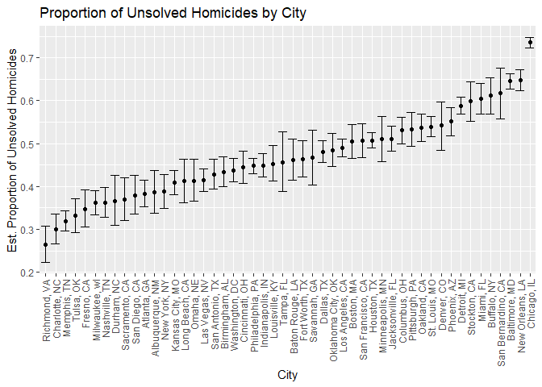
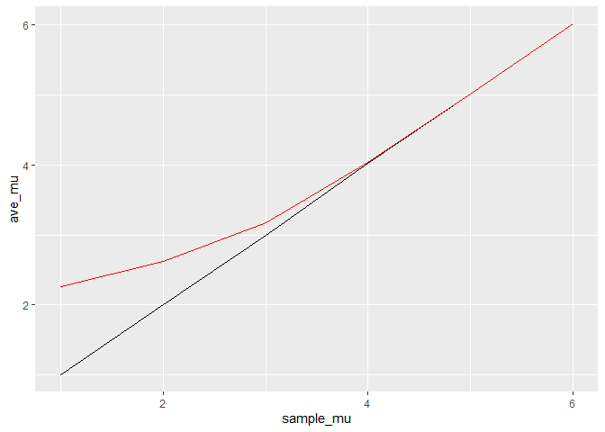

p8105_hw5_jc5929
================
2022-11-13

``` r
library(tidyverse)
```

    ## ── Attaching packages ─────────────────────────────────────── tidyverse 1.3.2 ──
    ## ✔ ggplot2 3.4.0      ✔ purrr   0.3.5 
    ## ✔ tibble  3.1.8      ✔ dplyr   1.0.10
    ## ✔ tidyr   1.2.1      ✔ stringr 1.4.1 
    ## ✔ readr   2.1.3      ✔ forcats 0.5.2 
    ## ── Conflicts ────────────────────────────────────────── tidyverse_conflicts() ──
    ## ✖ dplyr::filter() masks stats::filter()
    ## ✖ dplyr::lag()    masks stats::lag()

``` r
library(knitr)
library(purrr)
```

``` r
hom_df=read_csv("data/homicide-data.csv") %>%
  mutate(city_state=str_c(city,", ", state)) %>%
  filter(city_state != "Tulsa, AL")
```

    ## Rows: 52179 Columns: 12
    ## ── Column specification ────────────────────────────────────────────────────────
    ## Delimiter: ","
    ## chr (9): uid, victim_last, victim_first, victim_race, victim_age, victim_sex...
    ## dbl (3): reported_date, lat, lon
    ## 
    ## ℹ Use `spec()` to retrieve the full column specification for this data.
    ## ℹ Specify the column types or set `show_col_types = FALSE` to quiet this message.

## Problem 2

``` r
new_hom_data= hom_df %>%
  mutate(status=case_when(disposition=="Closed without arrest" ~ "unsolved",
                          disposition=="Open/No arrest" ~ "unsolved",
                          disposition=="Closed by arrest" ~ "solved")) %>%
  select(city_state,status) %>%
  group_by(city_state) %>%
  summarize(total_hom=n(),
            unsolve_obs=sum(status=="unsolved")) 
new_hom_data
```

    ## # A tibble: 50 × 3
    ##    city_state      total_hom unsolve_obs
    ##    <chr>               <int>       <int>
    ##  1 Albuquerque, NM       378         146
    ##  2 Atlanta, GA           973         373
    ##  3 Baltimore, MD        2827        1825
    ##  4 Baton Rouge, LA       424         196
    ##  5 Birmingham, AL        800         347
    ##  6 Boston, MA            614         310
    ##  7 Buffalo, NY           521         319
    ##  8 Charlotte, NC         687         206
    ##  9 Chicago, IL          5535        4073
    ## 10 Cincinnati, OH        694         309
    ## # … with 40 more rows

``` r
bm_test=prop.test(new_hom_data%>%filter(city_state=="Baltimore, MD")%>%pull(unsolve_obs),
          new_hom_data%>% filter(city_state=="Baltimore, MD")%>%pull(total_hom)) %>%
  broom::tidy() 

bm_est=bm_test%>%pull(estimate) 
bm_est
```

    ##         p 
    ## 0.6455607

``` r
bm_conf_low=bm_test%>%pull(conf.low)
bm_conf_low
```

    ## [1] 0.6275625

``` r
bm_conf_high=bm_test%>%pull(conf.high)
bm_conf_high
```

    ## [1] 0.6631599

``` r
prop_test= new_hom_data %>%
  mutate(output=map2(.x = unsolve_obs, .y = total_hom, ~prop.test(x=.x,n=.y)),
         tidy=map(.x=output,~broom::tidy(.x)))%>%
  select(-output) %>%
  unnest(tidy) %>%
  select(city_state, estimate, conf.low, conf.high)
```

``` r
prop_test %>%
  mutate(city_state = fct_reorder(city_state, estimate)) %>%
  ggplot(aes(x=city_state,y=estimate)) +geom_point()+
  geom_errorbar(aes(ymin = conf.low, ymax = conf.high)) +
  theme(axis.text.x = element_text(angle = 90, vjust = 0.5, hjust = 1)) +
  labs(
    title = "Proportion of Unsolved Homicides by City",
    x = "City",
    y = "Est. Proportion of Unsolved Homicides"
  )
```

<!-- -->

## Problem 3

``` r
sim_mean = function(n=30, mu=0, sigma = 5) {
  
  sim_data = tibble(
    x = rnorm(n, mean = mu, sd = sigma),
  )
  
  t_test=t.test(sim_data,mean=mu)
  sim_data %>% 
    summarize(
      mu_hat = mean(x),
      p_value= pull(broom::tidy(t_test),p.value)
    )
}
```

``` r
output = vector("list", 5000)

for (i in 1:5000) {
  output[[i]] = sim_mean(mu=0)
}

sim_results = bind_rows(output)
sim_results
```

    ## # A tibble: 5,000 × 2
    ##    mu_hat p_value
    ##     <dbl>   <dbl>
    ##  1  0.733 0.423  
    ##  2  1.15  0.141  
    ##  3 -0.488 0.631  
    ##  4 -1.64  0.0329 
    ##  5 -0.103 0.905  
    ##  6  1.21  0.247  
    ##  7  2.77  0.00377
    ##  8  2.06  0.0152 
    ##  9 -0.355 0.683  
    ## 10 -1.12  0.271  
    ## # … with 4,990 more rows

``` r
sim_results_df = 
  tibble(sample_mu = c(1, 2, 3, 4,5,6)) %>% 
  mutate(
    output_lists = map(.x = sample_mu, ~rerun(5000, sim_mean(mu = .x))),
    estimate_dfs = map(output_lists, bind_rows)) %>% 
  select(-output_lists) %>% 
  unnest(estimate_dfs)
```

``` r
sim_results_df %>%
  mutate(decision= case_when( p_value<0.05 ~ "reject",
                              p_value>0.05 ~ "fail to reject"))%>%
  mutate(as.factor(sample_mu)) %>%
  group_by(sample_mu)%>%
  summarize(total=n(),
            reject_obs=sum(decision=="reject"),
            reject_prop=reject_obs/total) %>%
  ggplot(aes(x=sample_mu,y=reject_prop))+geom_point()+geom_line()+
  labs(title = "Proportion of null hypothesis rejection for each true mean")
```

<!-- -->

``` r
reject_df=
  sim_results_df %>%
  mutate(decision= case_when( p_value<0.05 ~ "reject",
                              p_value>0.05 ~ "fail to reject")) %>%
  filter(decision=="reject") %>%
  group_by(sample_mu) %>%
  summarize(ave_mu=mean(mu_hat))


  sim_results_df %>%
  mutate(decision= case_when( p_value<0.05 ~ "reject",
                              p_value>0.05 ~ "fail to reject"))%>%
  mutate(as.factor(sample_mu)) %>%
  group_by(sample_mu)%>%
  summarize(ave_mu=mean(mu_hat)) %>%
  ggplot(aes(x=sample_mu,y=ave_mu))+geom_line()+geom_line(data=reject_df,color="red")
```

<!-- -->
