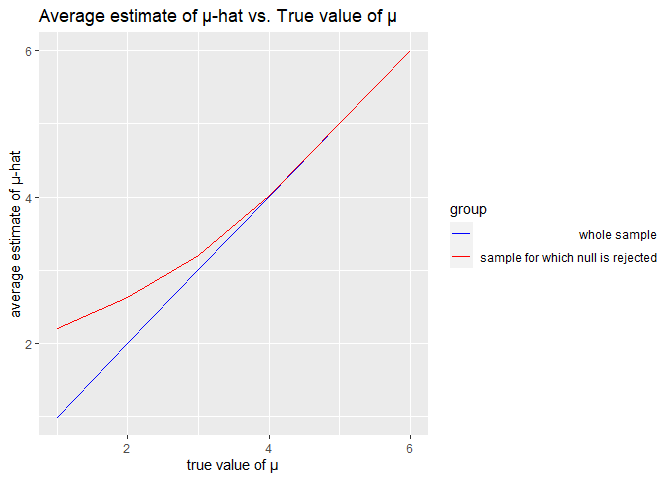

p8105_hw5_jc5929
================
2022-11-13

``` r
library(tidyverse)
```

    ## ── Attaching packages ─────────────────────────────────────── tidyverse 1.3.2 ──
    ## ✔ ggplot2 3.4.0      ✔ purrr   0.3.5 
    ## ✔ tibble  3.1.8      ✔ dplyr   1.0.10
    ## ✔ tidyr   1.2.1      ✔ stringr 1.4.1 
    ## ✔ readr   2.1.3      ✔ forcats 0.5.2 
    ## ── Conflicts ────────────────────────────────────────── tidyverse_conflicts() ──
    ## ✖ dplyr::filter() masks stats::filter()
    ## ✖ dplyr::lag()    masks stats::lag()

``` r
library(knitr)
library(purrr)
```

## Problem 1

``` r
knitr::opts_chunk$set(
  message = FALSE)
```


    ```r
    full_df = 
      tibble(
        files = list.files("data/zip_data/"),
        path = str_c("data/zip_data/", files)
      ) %>% 
      mutate(data = map(path, read_csv)) %>% 
      unnest()

    ## Warning: `cols` is now required when using unnest().
    ## Please use `cols = c(data)`

The result of the previous code chunk isn’t tidy – data are wide rather
than long, and some important variables are included as parts of others.
The code chunk below tides the data using string manipulations on the
file, converting from wide to long, and selecting relevant variables.

``` r
tidy_df = 
  full_df %>% 
  mutate(
    files = str_replace(files, ".csv", ""),
    group = str_sub(files, 1, 3)) %>% 
  pivot_longer(
    week_1:week_8,
    names_to = "week",
    values_to = "outcome",
    names_prefix = "week_") %>% 
  mutate(week = as.numeric(week)) %>% 
  select(group, subj = files, week, outcome)
```

Finally, the code chunk below creates a plot showing individual data,
faceted by group.

``` r
tidy_df %>% 
  ggplot(aes(x = week, y = outcome, group = subj, color = group)) + 
  geom_point() + 
  geom_path() + 
  facet_grid(~group)
```

<!-- -->

This plot suggests high within-subject correlation – subjects who start
above average end up above average, and those that start below average
end up below average. Subjects in the control group generally don’t
change over time, but those in the experiment group increase their
outcome in a roughly linear way.

## Problem 2

``` r
hom_df=read_csv("data/homicide-data.csv") %>%
  mutate(city_state=str_c(city,", ", state)) %>%
  filter(city_state != "Tulsa, AL")
```

**Description on the raw dataset:** This dataset contains homicides data
in 50 cities in the U.S. There were 12 variable describing the
characteristics of each victim in the raw data, including their name,
age, sex, and the disposition status. There were 52179 entries in total.

There exists a “Tulsa , AL” in the data set, which might be a tying
error or other error when entering the data. I have filtered out this
row when tidying the data.

``` r
new_hom_data= hom_df %>%
  mutate(status=case_when(disposition=="Closed without arrest" ~ "unsolved",
                          disposition=="Open/No arrest" ~ "unsolved",
                          disposition=="Closed by arrest" ~ "solved")) %>%
  select(city_state,status) %>%
  group_by(city_state) %>%
  summarize(total_hom=n(),
            unsolve_obs=sum(status=="unsolved")) 
new_hom_data
```

    ## # A tibble: 50 × 3
    ##    city_state      total_hom unsolve_obs
    ##    <chr>               <int>       <int>
    ##  1 Albuquerque, NM       378         146
    ##  2 Atlanta, GA           973         373
    ##  3 Baltimore, MD        2827        1825
    ##  4 Baton Rouge, LA       424         196
    ##  5 Birmingham, AL        800         347
    ##  6 Boston, MA            614         310
    ##  7 Buffalo, NY           521         319
    ##  8 Charlotte, NC         687         206
    ##  9 Chicago, IL          5535        4073
    ## 10 Cincinnati, OH        694         309
    ## # … with 40 more rows

``` r
prop.test(new_hom_data%>%filter(city_state=="Baltimore, MD")%>%pull(unsolve_obs),
          new_hom_data%>% filter(city_state=="Baltimore, MD")%>%pull(total_hom)) %>%
  broom::tidy()  %>%
   select(estimate, conf.low, conf.high) %>%
  knitr::kable()
```

|  estimate |  conf.low | conf.high |
|----------:|----------:|----------:|
| 0.6455607 | 0.6275625 | 0.6631599 |

``` r
prop_test= new_hom_data %>%
  mutate(output=map2(.x = unsolve_obs, .y = total_hom, ~prop.test(x=.x,n=.y)),
         tidy=map(.x=output,~broom::tidy(.x)))%>%
  select(-output) %>%
  unnest(tidy) %>%
  select(city_state, estimate, conf.low, conf.high)
```

``` r
prop_test %>%
  mutate(city_state = fct_reorder(city_state, estimate)) %>%
  ggplot(aes(x=city_state,y=estimate)) +geom_point()+
  geom_errorbar(aes(ymin = conf.low, ymax = conf.high)) +
  theme(axis.text.x = element_text(angle = 90, vjust = 0.5, hjust = 1)) +
  labs(
    title = "Proportion of Unsolved Homicides by City",
    x = "City",
    y = "Est. Proportion of Unsolved Homicides"
  )
```

<!-- -->

## Problem 3

``` r
sim_mean = function(n=30, mu=0, sigma = 5) {
  
  sim_data = tibble(
    x = rnorm(n, mean = mu, sd = sigma),
  )
  
  t_test=t.test(sim_data,mean=mu)
  sim_data %>% 
    summarize(
      mu_hat = mean(x),
      p_value= pull(broom::tidy(t_test),p.value)
    )
}
```

``` r
output = vector("list", 5000)

for (i in 1:5000) {
  output[[i]] = sim_mean(mu=0)
}

sim_results = bind_rows(output)
sim_results
```

    ## # A tibble: 5,000 × 2
    ##     mu_hat p_value
    ##      <dbl>   <dbl>
    ##  1  0.409    0.661
    ##  2  0.543    0.595
    ##  3 -0.230    0.798
    ##  4 -1.42     0.180
    ##  5 -0.474    0.646
    ##  6 -0.560    0.582
    ##  7 -0.0182   0.985
    ##  8  0.382    0.593
    ##  9 -0.0146   0.987
    ## 10  0.0245   0.979
    ## # … with 4,990 more rows

``` r
sim_results_df = 
  tibble(sample_mu = c(1, 2, 3, 4,5,6)) %>% 
  mutate(
    output_lists = map(.x = sample_mu, ~rerun(5000, sim_mean(mu = .x))),
    estimate_dfs = map(output_lists, bind_rows)) %>% 
  select(-output_lists) %>% 
  unnest(estimate_dfs)
```

``` r
sim_results_df %>%
  mutate(decision= case_when( p_value<0.05 ~ "reject",
                              p_value>0.05 ~ "fail to reject"))%>%
  mutate(as.factor(sample_mu)) %>%
  group_by(sample_mu)%>%
  summarize(total=n(),
            reject_obs=sum(decision=="reject"),
            reject_prop=reject_obs/total) %>%
  ggplot(aes(x=sample_mu,y=reject_prop))+geom_point()+geom_line()+
  labs(title = "Proportion of null hypothesis rejection for each true mean")
```

<!-- -->
According to the plot, power is positively related to effect size. The
`effect size = (true mean - mu null)` will increase since the true mu
increase from 1 to 6, and mu null also maintained to be 0. Thus, the
power will increased and reached the highest value 1 when mu is 4.

``` r
reject_df=
  sim_results_df %>%
  mutate(decision= case_when( p_value<0.05 ~ "reject",
                              p_value>0.05 ~ "fail to reject")) %>%
  filter(decision=="reject") %>%
  group_by(sample_mu) %>%
  summarize(ave_mu=mean(mu_hat))


  total_samp=sim_results_df %>%
  mutate(decision= case_when( p_value<0.05 ~ "reject",
                              p_value>0.05 ~ "fail to reject"))%>%
  mutate(as.factor(sample_mu)) %>%
  group_by(sample_mu)%>%
  summarize(ave_mu=mean(mu_hat)) 
  
  combine_df=bind_rows(list(a = total_samp, b = reject_df), .id = 'group')
  
  ggplot(combine_df)+
  geom_line(aes(x = sample_mu, y = ave_mu, color = group))+
  scale_color_manual(values = c("blue", "red"),
    labels = c(expression("whole sample"), expression("sample for which null is rejected")))+
    labs(x = "true value of µ", y = "average estimate of µ-hat",
       title = "Average estimate of µ-hat vs. True value of µ")
```

<!-- -->

When µ is smaller than 3, the average of µ-hat for which the sample
where null is rejected is higher than true value of µ. But µ gets
larger, the average of µ-hat across tests where the null is rejected
approaches the true value of µ.

From the previous plot, we can see that the proportion of times the null
was rejected is low. So for µ smaller than 3, the number of samples with
rejected null is relatively small. These sample have more variation and
their average is more likely to deviate from the true mean. However, as
µ gets bigger, there are more samples that rejects null, so the sample
average of µ-hat becomes more stable and yields a more unbiased
estimation of the true mean.
